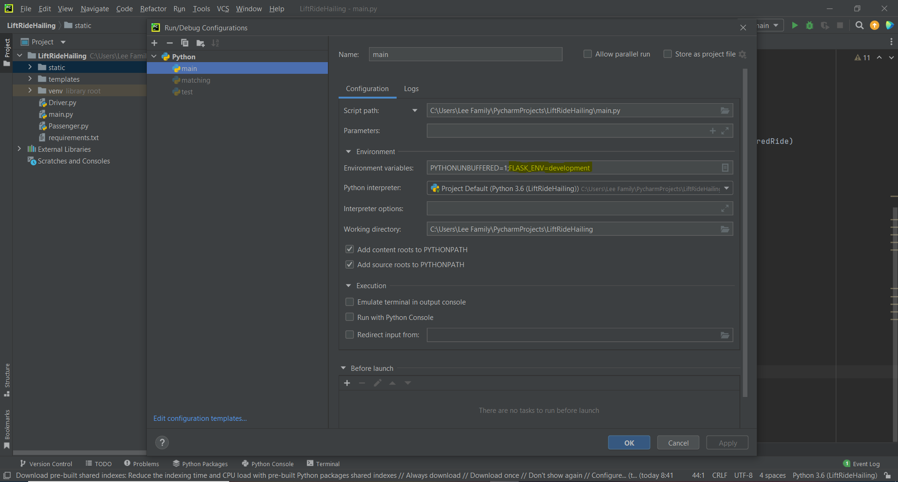

# Flask Installation

In Pycharm Terminal: install the required python packages stated in 'requirements.txt'
* pip install -r requirements.txt

Pycharm configuration: add new environment variable
* FLASK_ENV=development

